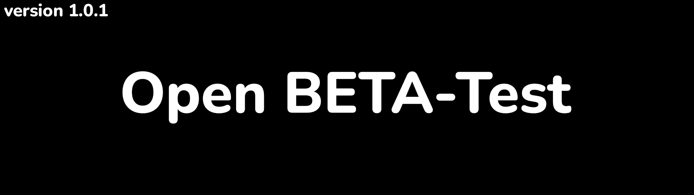

<h1 align="center">Mini Music Player</h1>

> **Mini Music Player** - is a handy and portable 
> music player for your PC. Witten on Python
> PyQT6 and pygame.

**About Player:**

 + **Player supports the main audio formats:** .MP3,
.WAV, .OGG  

 + **Main OS:** Windows (cross-platform issues will 
be discussed later)

 + **Player uses local music directories as 
playlists.**

***

<h3 align="center"><strong>Installation</strong></h3>

> *There is currently no version of the application available for installation.*
>
> **To install the latest version, navigate to 
> <a src="https://github.com/DanieloM83/Mini-Music-Player/releases/">
> releases</a> and select the appropriate version. Then download the 
> archive with the installer, and install Music Player like any other 
> program.**

***

<h3 align="center"><strong>Usage</strong></h3>

> **Once installed, you can use the Music Player, here are some tips and usage 
> instructions:**
> + **You can put the application on autoload along with your OS.**
> + **After launch, you need to create the first playlist. To do 
> this, click on the "+" icon and select the path to the folder 
> with your music**
> + **Select a playlist and click the "Play" button**
> + **When you press the "F8" key, the window is minimized and 
    > unfolded. By default, it is on top of all other windows, 
    > which makes the player very convenient and compact.**

***

<h3 align="center"><strong>Releases</strong></h3>

<h4>
<strong>

> + Beta:
>    + 1.0.0 - first, rawest release. *[05.20.2023]*

</strong>
</h4>

***

<h3 align="center"><strong>Acknowledgments</strong></h3>

**Thanks.**