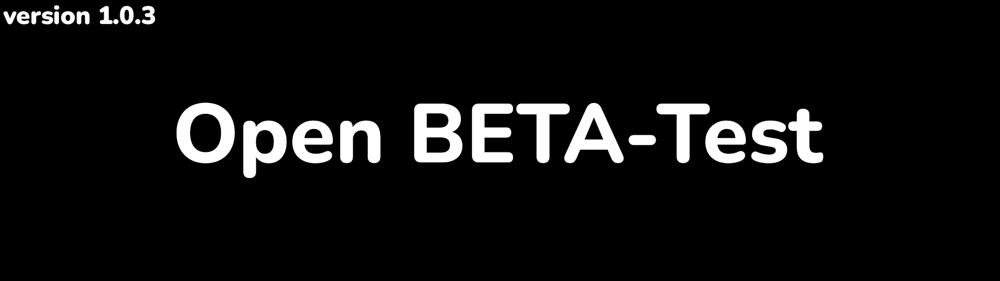

<h1 align="center">Mini Music Player</h1>

> **Mini Music Player** - is a handy and portable 
> music player for your PC. Witten on Python
> PyQT6 and pygame.

**About Player:**

 + **Player supports the main audio formats:** .MP3,
.WAV, .OGG  

 + **Main OS:** Windows (cross-platform issues will 
be discussed later)

 + **Player uses local music directories as 
playlists.**

***

<h3 align="center"><strong>Installation</strong></h3>

> **To install the latest version, navigate to 
> [releases](https://github.com/DanieloM83/Mini-Music-Player/releases) and select the appropriate version. 
> Then download the archive with the application, unzip it to any place and run the program's executable file 
> (you can also create a shortcut).**

***

<h3 align="center"><strong>Usage</strong></h3>

> **Once installed, you can use the Music Player, here are some tips and usage 
> instructions:**
> + **You can put the application on autoload along with your OS.**
> + **After launch, you need to create the first playlist. To do 
> this, click on the "+" icon and select the path to the folder 
> with your music**
> + **Select a playlist and click the "Play" button**
> + **When you press the "F8" key, the window is minimized and 
> unfolded. By default, it is on top of all other windows, 
> which makes the player very convenient and compact.**

 

***

<h3 align="center"><strong>Releases</strong></h3>

<h4>
<strong>

> + Beta:
>   + [1.0.0 - first, rawest release. *[05.20.2023]*](https://github.com/DanieloM83/Mini-Music-Player/releases/tag/v1.0.0-beta)
>   + [1.0.1 - add some functional. *[05.25.2023]*](https://github.com/DanieloM83/Mini-Music-Player/releases/tag/v1.0.1-beta)
>   + [1.0.2 - volume slider. *[06.01.2023]*](https://github.com/DanieloM83/Mini-Music-Player/releases/tag/v1.0.2-beta)
>   + [1.0.3 - adaptability. *[06.13.2023]*](https://github.com/DanieloM83/Mini-Music-Player/releases/tag/v1.0.3-beta)

</strong>
</h4>

***

<h3 align="center"><strong>Acknowledgments</strong></h3>

**Thanks.**
